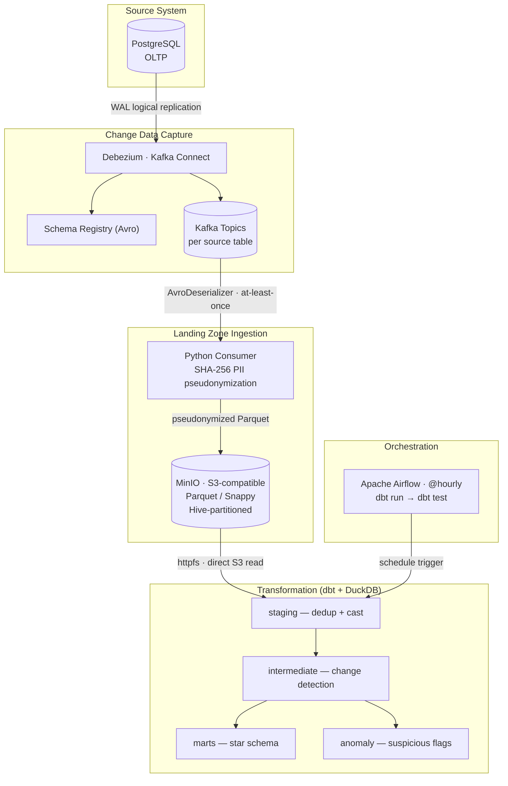

# LedgerLens

A CDC-driven, GDPR/BaFin-aware financial transaction analytics platform.  
Captures changes from an OLTP banking system in real time, models them into a dimensional warehouse via dbt, and flags suspicious transactions.

> **Portfolio project** — every architectural choice is defensible in a technical interview.  
> Built for a Data Engineering / AI Engineering job search in Germany.

---

## Architecture



---

## Tech Stack

| Layer | Technology | Why |
|---|---|---|
| Source system | PostgreSQL 16 | CDC-ready (`wal_level=logical`) |
| CDC | Debezium 2.x via Kafka Connect | Captures inserts, updates **and deletes** — batch exports cannot |
| Streaming backbone | Apache Kafka + Schema Registry (Avro) | Schema evolution, at-least-once delivery guarantee |
| Landing zone | MinIO (S3-compatible), Parquet/Snappy | Immutable, replayable raw layer; rebuild marts at any time |
| PII protection | SHA-256 pseudonymization in consumer layer | PII never reaches Kafka, landing zone, or marts |
| Transformation | dbt-duckdb + httpfs | Lakehouse pattern — DuckDB reads Parquet from S3 directly, no separate warehouse service |
| SCD Type 2 | `dim_accounts` (balance/status history) | Concrete proof of CDC advantage: full change timeline vs. a batch snapshot |
| Anomaly detection | Rule-based SQL in dbt | Explainable, auditable — BaFin compliance requires a reproducible "why" for every suspicious flag |
| Orchestration | Apache Airflow (standalone, @hourly) | Industry-standard scheduling with structured failure logging |
| Compliance | GDPR/BaFin retention config (Kafka TTL + MinIO lifecycle) | 7-year financial records (BaFin §257 HGB), 90-day PII (GDPR Art. 5) |

---

## Repository Structure

```
ledgerlens/
├── oltp/                    # Synthetic OLTP schema + seed generator
│   ├── schema.sql
│   └── seed_generator.py
├── cdc/                     # Debezium connector config + registration script
│   └── connectors/ledgerlens-source.json
├── consumer/                # Kafka → MinIO ingestion pipeline
│   ├── consumer.py          # Main loop: flush on interval or message count
│   ├── pseudonymizer.py     # SHA-256 PII masking
│   ├── writer.py            # Debezium envelope → Parquet
│   └── uploader.py          # Parquet → MinIO (boto3)
├── dbt_project/
│   └── models/
│       ├── staging/         # Dedup, type casts
│       ├── intermediate/    # Change detection (int_account_changes)
│       ├── marts/           # Star schema: fact_transactions, dim_*
│       └── anomaly/         # mart_suspicious_transactions
├── airflow/
│   └── dags/ledgerlens_dbt.py
├── gdpr/
│   └── configure_retention.py   # Kafka TTL + MinIO lifecycle (idempotent)
├── docker-compose.yml
└── .env.example
```

---

## Quick Start

### Prerequisites
- Docker Desktop
- Python 3.11+

### 1 — Configure environment

```bash
cp .env.example .env
# Fill in: POSTGRES_PASSWORD, MINIO_ROOT_PASSWORD, PSEUDONYM_SALT,
#          AIRFLOW_FERNET_KEY, AIRFLOW_ADMIN_PASSWORD
# Generate fernet key:
python -c "from cryptography.fernet import Fernet; print(Fernet.generate_key().decode())"
```

### 2 — Start the stack

```bash
docker compose up -d
```

Services: PostgreSQL, Zookeeper, Kafka, Schema Registry, Kafka Connect, MinIO, Consumer, Airflow (port 8088).

### 3 — Register Debezium CDC connector

```bash
python cdc/register_connector.py
```

### 4 — Seed the OLTP database

```bash
pip install numpy psycopg2-binary faker pydantic
python oltp/seed_generator.py
# Generates ~500 customers, ~987 accounts, ~102k transactions
# ~30 accounts contain planted burst anomaly patterns
```

### 5 — Run dbt (Windows: local cache; Linux/Mac: direct S3)

```bash
pip install dbt-duckdb boto3
# Windows only — download Parquet from MinIO to local cache:
python dbt_project/fetch_from_minio.py
cd dbt_project
dbt run --profiles-dir . --vars '{"landing_base_url": "landing_cache"}'
dbt test --profiles-dir .
```

On Linux/Mac, uncomment the `httpfs` block in `dbt_project/profiles.yml` and run without `--vars`.

### 6 — Apply retention policies

```bash
python gdpr/configure_retention.py
```

### 7 — Airflow UI

Open `http://localhost:8088` — trigger the `ledgerlens_dbt` DAG manually or wait for the hourly schedule.

---

## Key Design Decisions

**CDC over batch export**  
Batch exports capture a point-in-time snapshot and miss deletes/updates. Debezium reads PostgreSQL's Write-Ahead Log and captures every change, including the `before`/`after` state. This is how production fintech platforms maintain near-real-time analytics without adding read load to the OLTP system.

**DuckDB lakehouse (no separate warehouse)**  
dbt-duckdb with the `httpfs` extension reads Parquet files directly from MinIO via the S3 protocol. No Spark, no Snowflake, no ETL load job — the query engine goes to the data. Suitable for analytics workloads up to tens of billions of rows on a single node; beyond that, the natural upgrade path is MotherDuck or a dedicated Trino/Spark cluster.

**SCD Type 2 on `dim_accounts`**  
Every balance or status change creates a new dimension row (`valid_from`, `valid_to`, `is_current`, `version_number`). A batch export would give only the current balance. CDC gives the complete change timeline — this is the concrete, queryable proof of why CDC exists.

**Rule-based anomaly detection (not ML)**  
Three SQL window-function rules: `BURST_TRANSFER` (≥5 transfers in 2h), `HIGH_VALUE_OUTLIER` (amount > 4×mean + 2×stddev), `DORMANT_SPIKE` (same-day count ≥5 and ≥3× daily average). Rules are the industry-standard first gate in AML pipelines because every flag must answer the compliance question: *"why is this transaction suspicious?"* — a question a black-box model cannot answer for BaFin audit purposes.

**GDPR pseudonymization at the earliest point**  
SHA-256 + salt is applied in the consumer layer before writing to MinIO. Raw PII (name, IBAN, national ID) never enters Kafka, the landing zone, or any mart. The production upgrade path is per-customer key deletion (crypto-shredding), documented in [`CLAUDE.md §8`](CLAUDE.md).

---

## Compliance Notes

| Layer | Retention | Basis |
|---|---|---|
| Kafka — transactions, accounts | 7 years | BaFin §257 HGB |
| Kafka — customers | 90 days | GDPR Art. 5(1)(e) |
| MinIO — transactions/, accounts/ | 7 years | BaFin §257 HGB |
| MinIO — customers/ | 90 days | GDPR Art. 5(1)(e) |
| dbt marts | follows source | derived layer |

GDPR right-to-erasure design and the crypto-shredding upgrade path are documented in detail in [`CLAUDE.md §8`](CLAUDE.md).

---

## Non-Goals

This is a portfolio project demonstrating data engineering patterns, not a production system. There is no real banking data, no production-grade auth hardening, and no multi-region HA design. Each of these would be a real concern in production — the README and code comments call out where they would matter.
